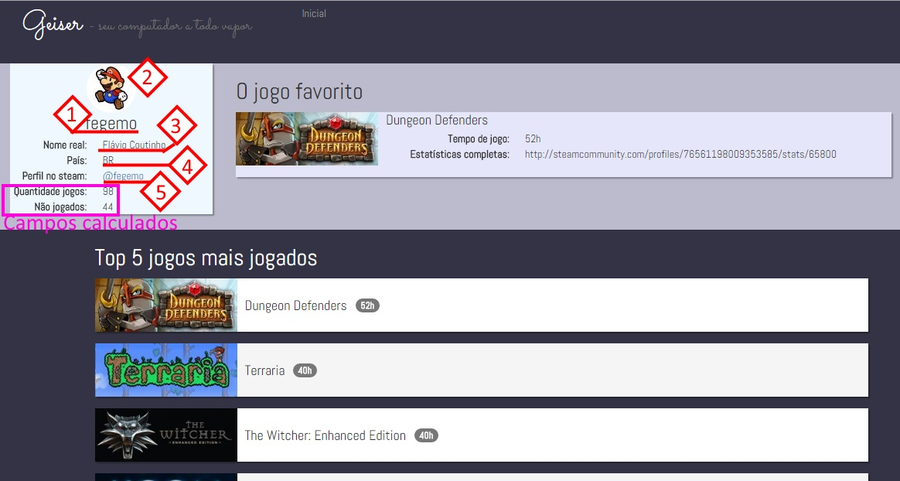
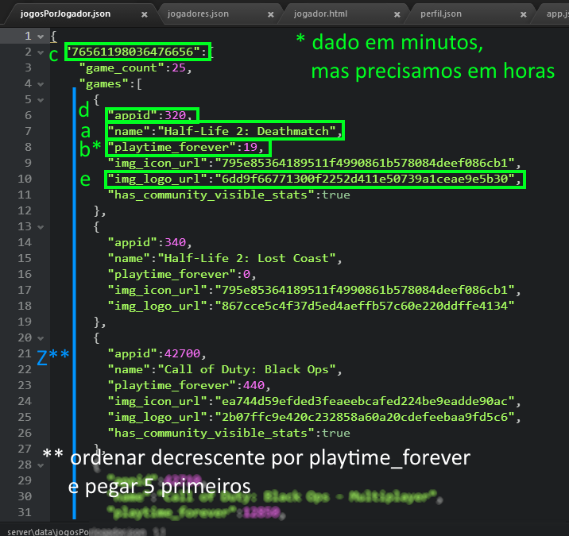

# Geiser 💨

Um mostruário de algumas pessoas que ficam fritando seus PCs. Há uma página que mostra essas pessoas e outra com detalhes sobre o que elas andam fazendo com seus computadores.


## Atividade

Você deve criar duas páginas dinâmicas usando Node.js e Express.js.


### Exercício 0: Configuração do Projeto

Você deve criar um arquivo `package.json` para caracterizar a pasta como um pacote Node.js.

Para tal, você pode pedir auxílio ao npm. Após clonar seu _fork_, abra o terminal na pasta e:

```
$ npm init
```

Nesse momento, o npm fará perguntas no terminal para alguns parâmetros descritivos do seu pacote. Ao digitar os valores e concluir a operação, um arquivo `package.json` terá surgido na pasta.

Depois, você deve instalar a dependência do pacote `express`:

1. express (`npm install express`)

**Para executar**, você pode digitar:

```
$ node server/app.js
```

E, como o "código de entrada" do programa está nesse arquivo `app.js`, a aplicação será iniciada.

Contudo, repare que o arquivo `server/app.js` ainda não está fazendo nada de útil.


### Exercício 1: Arquivos Estáticos

Você deve agora abrir um servidor na porta 3000, configurado para servir estaticamente todos os arquivos da pasta `client/`.

Repare que o projeto já tem uma estrutura de diretórios e alguns arquivos criados:

1. Pasta `client/` com arquivos estáticos (`css/`, `.html`)
   - Os arquivos `.exemplo.html` são aqueles que devem se tornar dinâmicos
1. Pasta `server/` com arquivos dinâmicos do servidor, views etc.
   - O ponto de entrada é `server/app.js`
   - `sever/data/` contém as informações que precisamos para tornar as páginas dinâmicas em arquivos no formato JSON

Agora, modifique o arquivo `server/app.js` para ativar um servidor estático

  - o servidor deve servir os arquivos da pasta `client/`
  - Passos:
    1. Em `server/app.js`, importe o pacote `express`
       - Você pode usar CommonJS ou ES6 Modules
       - Para usar ES6 Modules, você pode renomear os arquivos para `.mjs` ou colocar uma propriedade no `package.json`: `"type": "module"` e continuar usando `.js` (aí todos os arquivos serão considerados módulos ES6)
    1. Use o _middleware_ (`app.use`) `express.static(CAMINHO_PARA_PASTA)`, especificando a pasta onde estão os arquivos estáticos
    1. "Abra" o servidor e deixe-o escutando (`app.listen`) na porta 3000
    1. Teste seu servidor executando:
       ```
       $ node server/app.js
       ```

**Para verificar** se o servidor estático está funcionando, acesse o endereço  http://localhost:3000/index.exemplo.html e veja se a página carregou devidamente.


### Exercício 2: Página Inicial

Neste exercício você deve criar a página `views/index.hbs` de forma que os usuários mostrados nela sejam buscados a partir do arquivo `data/jogadores.json`.

1. Instalar o _templating engine_ como uma dependência (se já não tiver feito isto)
1. [Configurar](http://expressjs.com/en/guide/using-template-engines.html) o _templating engine_
   - Em particular, você vai precisar definir `view engine` e `views` (caminho para pasta contendo suas _views_)
1. Carregar o arquivo `data/jogadores.json` para um objeto JavaScript
   - Repare que já existe um objeto vazio na variável `db` no arquivo `server/app.js`
   - Você pode carregar o arquivo de forma síncrona ou assíncrona usando o módulo _file system_ (fs)
   - Lembre-se de que o módulo _file system_ é da plataforma do Node.js, então **não é necessário instalá-lo**
   - Há 3 opções para ler arquivos: `fs.readFileSync(CAMINHO)`, `fs.readFile(CAMINHO, CALLBACK)` e `await readFile(CAMINHO)` (este último caso você use `import { readFile } from 'fs/promises'`)
   - Se for usar um `CAMINHO` relativo (super recomendado), entenda que ele é relativo ao _cwd_ (_current working directory_). Se você está executando `node server/app.js`, o _cwd_ é a raiz do projeto. Logo, se usar `data/jogadores.json` o arquivo não será encontrado...
   - Ao carregar o arquivo, o que é retornado (na chamada síncrona), passado como 2º argumento (na chamada assíncrona) ou resolvido (na chamada com promessa) é uma **_string_ com o conteúdo do arquivo JSON**
   - Sendo assim, é necessário desserializar essa _string_ em um objeto Javascript usando `JSON.parse(STRING)`
1. Criar uma rota do tipo `GET` ([`app.get(...)`](http://expressjs.com/starter/basic-routing.html)) para o caminho "/" (página inicial) que renderize ([`response.render(...)`](http://expressjs.com/en/4x/api.html#res.render)) a _view_ que está em `server/views/index.hbs` (ou outra extensão)
   - Repare que o argumento para a função `response.render(NOME, CONTEXTO_DE_DADOS)` é apenas o nome da _view_, sem a extensão nem a pasta


Neste momento, você pode testar no navegador se a rota e a _view_ estão sendo encontrada e renderizada acessando [http://localhost:3000/](http://localhost:3000/).

1. Agora você deve alterar a _view_ `server/views/index.hbs` (ou outra extensão) para torná-la dinâmica
   - Use os comentários no arquivo `server/views/index.hbs` para saber como mapear os campos do "banco de dados" para a _view_
   - Se estiver usando [Handlebars](http://handlebarsjs.com/), você vai precisar de:
     1. [Expressões](http://handlebarsjs.com/#getting-started)
     1. [Block `each`](http://handlebarsjs.com/builtin_helpers.html#iteration), para iterar no _array players_


### Exercício 3: Página do Jogador

Siga os mesmos passos da página inicial, mas agora para a página de detalhes de um jogador:

- Rota: `/jogador/:numero_identificador/`, responde ao verbo `GET` apenas
- _View_: renderizar `server/views/jogador.hbs`
- Contexto de dados: vêm de 3 fontes diferentes
  1. De `jogadores.json`
  1. De `jogosPorJogador.json`
  1. Calculados das outras duas fontes

Veja nas imagens a seguir de onde vêm os dados para cada elemento da interface:







Mais informações vide slides: [16](http://fegemo.github.io/cefet-web/classes/ssn4/#16).


### FAQ

Quem quiser **colocar os seus próprios dados de uso do Steam** para a
prática pode seguir os seguintes passos:

1. Solicitar uma API key (como se fosse um usuário e senha) de acesso aqui:
   [Obtaining a Steam Web API Key](http://steamcommunity.com/dev)
1. Para montar o `server/data/jogadores.json`:
   1. Vamos usar [a chamada GetPlayerSummaries da API](https://developer.valvesoftware.com/wiki/Steam_Web_API#GetPlayerSummaries_.28v0002.29)
   1. Fazer a seguinte chamada, no próprio navegador mesmo: [http://api.steampowered.com/ISteamUser/GetPlayerSummaries/v0002/?key=SUA_API_KEY_AQUI&steamids=ID_DO_STEAM_DO_USUARIO1,ID_DO_USUARIO2,ID_DO_USUARIO3](http://api.steampowered.com/ISteamUser/GetPlayerSummaries/v0002/?key=SUA_API_KEY_AQUI&steamids=ID_DO_STEAM_DO_USUARIO1,ID_DO_USUARIO2,ID_DO_USUARIO3) substituindo os valores
      - Ela retorna um objeto com uma propriedade "response", que possui uma propriedade "players", que é um array de jogadores
      - Repare que é possível solicitar a informação de mais de um usuário, separado por vírgula
      - Você pode pegar apenas a sua informação, ou a de colegas (ou pegar a sua + dos amigos do professor - mostradas a seguir)
      - Como achar um SteamID dado o nome de usuário? Faça uma busca em [steamid.io](https://steamid.io) e peque o campo steamID64 (número grandão)
         - ID do professor: 76561198009353585
         - ID do Isrárá (amigo do professor): 76561197989267556
         - ID do Cris (amigo do professor): 76561198039780604
         - ID do Elder Coutinho (irmão): 76561198033038395 
   1. Retire essa propriedade `response` e deixe o arquivo como o `jogadores.json` que está no repositório (ou seja, só um objeto com a propriedade `players`).
   1. Salvar isso como sendo o arquivo `server/data/jogadores.json`
1. Para montar o `server/data/jogosPorJogador.json`:
   1. Este vai ser mais artesanal. Vamos usar [a chamada GetOwnedGames](https://developer.valvesoftware.com/wiki/Steam_Web_API#GetOwnedGames_.28v0001.29) que retorna todos os jogos comprados por um jogador e o tempo que ele passou jogando-os.
   1. Faça uma chamada para a URL seguinte para cada usuário que existe no arquivo  server/data/jogadores.json: [http://api.steampowered.com/IPlayerService/GetOwnedGames/v0001/?key=SUA_API_KEY&steamid=ID_DO_USUARIO&include_appinfo=1](http://api.steampowered.com/IPlayerService/GetOwnedGames/v0001/?key=SUA_API_KEY&steamid=ID_DO_USUARIO&include_appinfo=1)
   1. O arquivo  `server/data/jogosPorJogador.json` deve conter um objeto que contém uma propriedade com o ID do usuário para cada usuário. O valor dessa propriedade deve ser o conteúdo da "response" retornada em cada chamada que foi feita para GetOwnedGames (veja como deve ficar o arquivo no final)